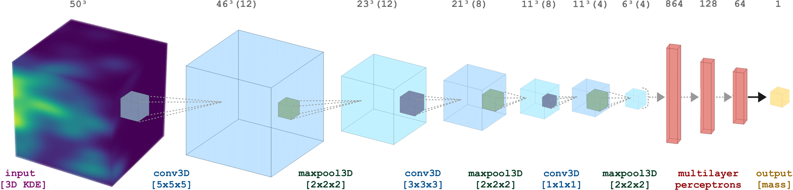

# SBI_dynamical_mass_estimator
**Dynamical mass inference of galaxy clusters using a 3D convolutional neural network**

#### The network architecture & training methodology, mock cluster catalogue and results are detailed in:  
"*Simulation-based inference of dynamical galaxy cluster masses with 3D convolutional neural networks*,"  
Doogesh Kodi Ramanah, Radoslaw Wojtak, Nikki Arendse [[arXiv:2009.03340]](https://arxiv.org/abs/2009.03340)

#### Note:  
1) Network implementation and training routine for the 3D CNN model is in `train.py`;
2) The notebook `dynamical_mass_inference.ipynb` provides a stepwise description of the simulation-based inference aspect and illustrates some plots;
3) The mock cluster generated for our project is available [here](https://sid.erda.dk/share_redirect/awUCT5pEQR). Please cite the above paper if you make use of our mock cluster catalogue. The script `gen_KDE_mock.py` shows an example of how to load and text files and generate their 3D KDE representations as employed in our work.

